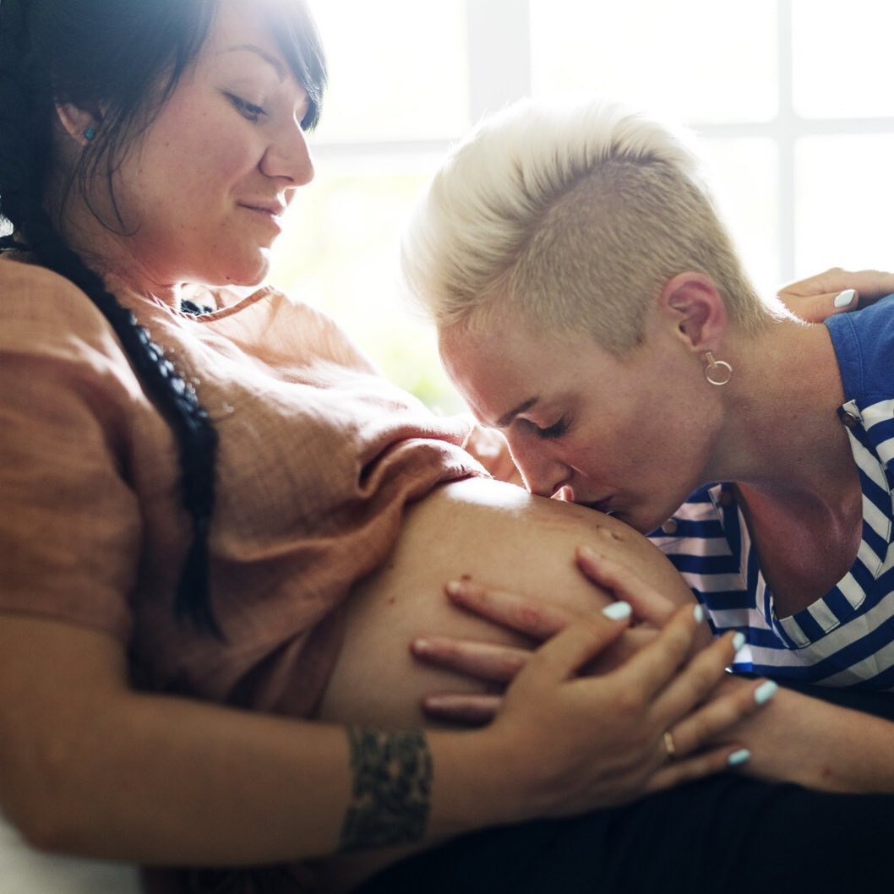
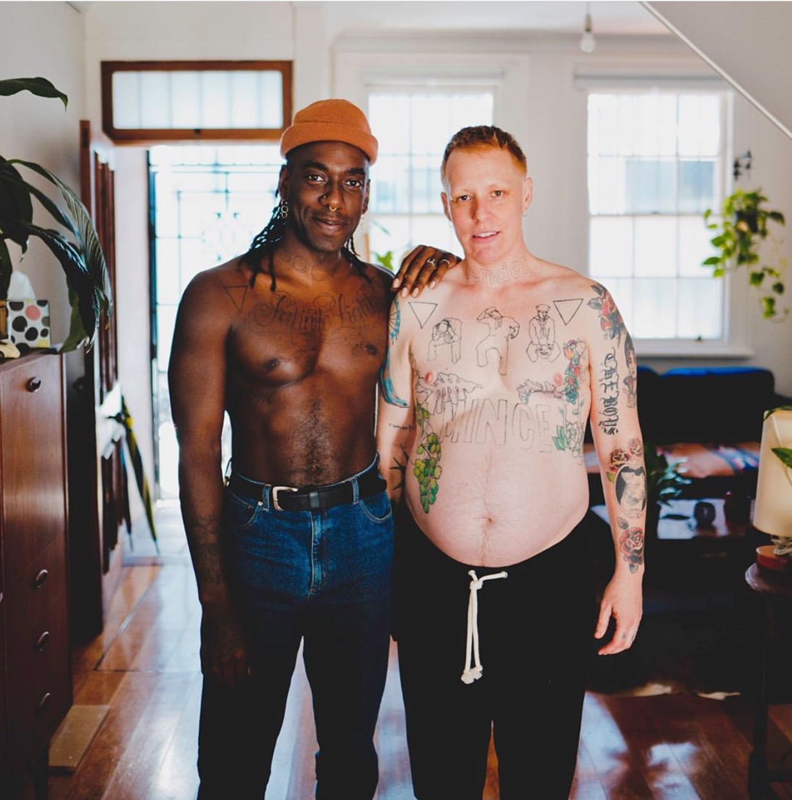
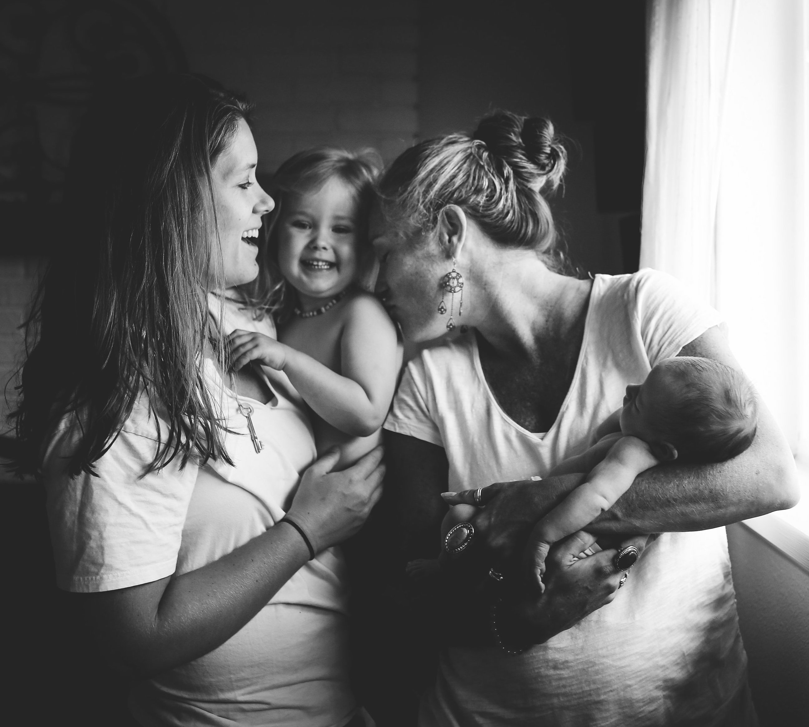

My research interest includes perinatal health disparities among childbearing [sexual and gender minorities (SGM)](https://dpcpsi.nih.gov/sgmro). 

I am currently working under Drs. [Walter Bockting](http://www.nursing.columbia.edu/profile/wbockting) and [Maureen George](http://www.nursing.columbia.edu/profile/mgeorge) to explore social support experinces among SGM childbearing individuals across the perinatal period. 

My mission is to build a foundation of research that makes SGM health disparities visible and promotes health equity for individuals and families in this community.

Learn more about my [academic work](cv/Soled_Biosketch.pdf) and stay connected to [my research](https://www.researchgate.net/profile/Kodiak_Soled). 

     